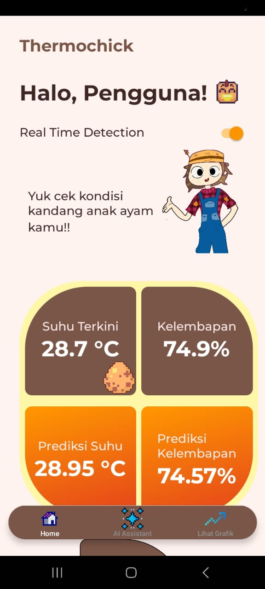
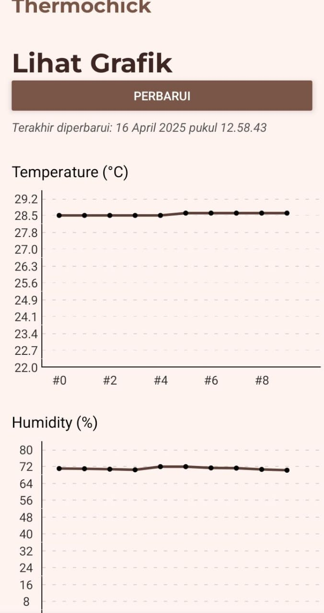
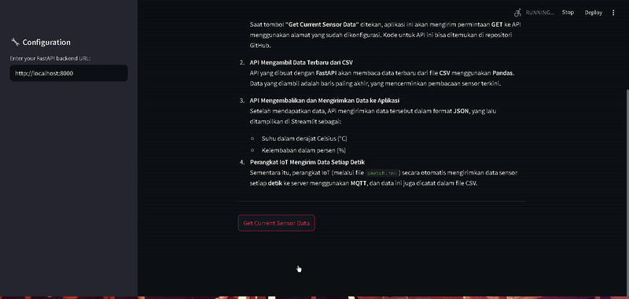

# 🐣 ThermoChick

ThermoChick adalah aplikasi berbasis **IoT dan AI** yang dikembangkan sebagai bagian dari _Stage 3 SIC Assignment Project_. Aplikasi ini dirancang untuk membantu peternak ayam dengan **memantau suhu dan kelembaban kandang secara otomatis**, serta memberikan **dukungan asisten AI** dan **kontrol otomatis terhadap lampu pemanas** berdasarkan kondisi lingkungan.

---

## 🚀 Teknologi yang Digunakan

- **React Native** – Untuk aplikasi mobile
- **FastAPI** – Backend server untuk menangani API request
- **ESP32** – Mikrokontroler untuk mengirim data dari sensor
- **DHT22** – Sensor suhu dan kelembaban
- **ROBOTDYN Thyristor AC** – Mengatur ON/OFF lampu pemanas ayam
- **Gemini API + RAG Model** – Asisten AI berbasis Retrieval-Augmented Generation (RAG)

---

## 📱 Fitur Utama

### A. Dashboard Monitoring

- ESP32 membaca data suhu dan kelembaban dari DHT22, lalu mengirimkannya ke backend menggunakan **POST method** (FastAPI).
- Data real-time ini diambil oleh aplikasi **React Native** melalui **GET method**, lalu ditampilkan dalam tampilan dashboard.
- Aplikasi juga melakukan **prediksi suhu** menggunakan model **Polynomial Regression** yang dilatih dari file `.csv` berisi riwayat suhu sebelumnya. Ini adalah implementasi **machine learning**.


### B. AI Assistant

- Pengguna dapat mengetikkan pertanyaan di aplikasi.
- Input ini diproses menggunakan **Sentence Transformer** (all-MiniLM-L6-v2) untuk pencocokan semantik.
- Sistem **RAG (Retrieval-Augmented Generation)** akan mencari jawaban yang relevan dari basis pengetahuan.
- Jawaban ini dianalisis lebih lanjut menggunakan **Gemini API** generative AI, lalu ditampilkan kepada pengguna di aplikasi.
- Semua komunikasi dilakukan melalui backend **FastAPI**.


### C. Grafik Monitoring

- Aplikasi menyediakan tampilan **Line Chart** untuk melihat tren suhu dan kelembaban.
- Backend menyediakan endpoint **GET** untuk mengambil **5 data terbaru** dari file `.csv`. 
- Data yang ditampilkan berasal dari sensor DHT22 yang terhubung ke ESP32.


### D. Otomatisasi Lampu Pemanas

- Sistem secara otomatis **menghidupkan atau mematikan** lampu pemanas ayam berdasarkan suhu yang dideteksi.
- Kontrol dilakukan menggunakan **ROBOTDYN Thyristor AC** yang terhubung ke ESP32 dan dikendalikan dari backend jika suhu melewati threshold tertentu.
---
#### Lampu mati
.png)
#### Lampu menyala
.png)
---

## 🛠️ Cara Menjalankan Proyek

Sebelum memulai, pastikan semua dependency sudah terinstal pada setiap komponen (FastAPI, React Native, Arduino, dan Streamlit).

### 🔧 Langkah-Langkah Instalasi & Menjalankan

1. **Jalankan Backend FastAPI**  
   Masuk ke folder `backend` dan jalankan perintah berikut:
   ```bash
   uvicorn main:app --reload --host=0.0.0.0
   ```

2. **Jalankan Aplikasi React Native (Client App)**  
   Masuk ke folder `poultry-app` dan gunakan Expo CLI:
   ```bash
   npx expo start
   ```

3. **Upload dan Jalankan Kode IoT di ESP32**  
   Buka kode dalam folder `IoT` menggunakan **Arduino IDE**, kemudian upload ke board **ESP32** yang terhubung dengan sensor DHT22 dan lampu ayam melalui ROBOTDYN Thyristor AC.

4. **(Optional) Jalankan Streamlit untuk Uji Coba API**  
   Jika ingin menguji API menggunakan antarmuka visual dengan Streamlit, masuk ke folder `streamlit` dan jalankan:
   ```bash
   streamlit run main.py
   ```
