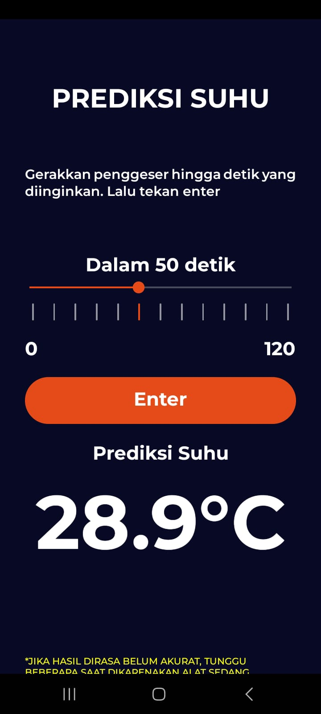

# 🐣 ThermoChick

ThermoChick adalah aplikasi berbasis **IoT dan AI** yang dikembangkan sebagai bagian dari _Stage 4 SIC Assignment Project_. Aplikasi ini dirancang untuk membantu peternak ayam dengan **memantau suhu dan kelembaban kandang secara otomatis**, serta memberikan **dukungan asisten AI** dan **kontrol otomatis terhadap lampu pemanas** berdasarkan kondisi lingkungan.

---

## 🚀 Teknologi yang Digunakan

- **React Native + Expo** – Untuk aplikasi mobile
- **FastAPI** – Backend server untuk menangani API request
- **QuestDB dan Supabase** - Sebagai database IoT dan Pengguna
- **ESP32** – Mikrokontroler untuk mengirim data dari sensor
- **DHT22** – Sensor suhu dan kelembaban
- **ROBOTDYN Thyristor AC** – Mengatur ON/OFF lampu pemanas ayam
- **NEO 6m GPS Module** - Sensor lokasi kandang
- **Gemini API + RAG Model** – Asisten AI berbasis Retrieval-Augmented Generation (RAG)

---


## 📱 Fitur Utama

### A. Dashboard Monitoring

Pengguna dapat memantau suhu dan kelembaban kandang secara real-time melalui antarmuka aplikasi, yang diperbarui setiap 5 detik. Sistem ini juga menyajikan prediksi suhu dan kelembaban berdasarkan data historis.

* ESP32 membaca data suhu dan kelembaban dari sensor *DHT22, lalu mengirimkan data tersebut ke backend melalui **metode POST* menggunakan *FastAPI*.
* Aplikasi *React Native* mengambil data secara real-time melalui *metode GET* untuk ditampilkan dalam tampilan dashboard.
* Backend menyimpan data sensor ke dalam *QuestDB* sebagai basis data time-series.
* Model *Polynomial Regression* dilatih menggunakan data di QuestDB untuk melakukan prediksi suhu dan kelembaban secara berkala.
<p align="center">
  
  
</p>
---

### B. Custom Threshold

Fitur ini memungkinkan pengguna mengatur sendiri batas suhu yang akan memicu lampu pemanas menyala secara otomatis.

* Pengaturan batas suhu dapat dilakukan melalui aplikasi dan disimpan di *Supabase*.
* ESP32 akan mengambil nilai threshold terbaru dari backend menggunakan *metode GET*.
* Perubahan nilai threshold akan langsung ditanggapi oleh ESP32 sehingga sistem tetap adaptif terhadap konfigurasi terbaru.
<p align="center">
  
  
</p>
---

### C. Otomatisasi Lampu Pemanas

Lampu pemanas akan dikendalikan secara otomatis oleh sistem berdasarkan pembacaan suhu aktual dari sensor.

* Jika suhu berada di bawah atau mendekati nilai threshold, sistem akan menyalakan lampu pemanas secara otomatis.
* Kontrol perangkat dilakukan menggunakan *ROBOTDYN Thyristor AC* yang terhubung ke ESP32 dan dikendalikan oleh backend.
<p align="center">
  
</p>
---

### D. Prediksi Suhu dan Kelembaban (Custom)

Pengguna dapat menentukan sendiri rentang waktu prediksi suhu dan kelembaban hingga maksimal 120 detik ke depan.

* Rentang prediksi diatur melalui input pengguna dalam satuan detik.
* Setelah dikirim, API akan memproses permintaan dan menghasilkan prediksi menggunakan data dari *QuestDB* dan model *Polynomial Regression*.
* Hasil prediksi ditampilkan secara langsung di dalam aplikasi.
<p align="center">
  
  
</p>
---

### E. Data Suhu dan Kelembaban Eksternal

Sensor GPS yang tertanam pada ESP32 memungkinkan aplikasi untuk mengambil informasi cuaca dari luar kandang berdasarkan titik koordinat.

* Data GPS dikirim ke backend melalui *FastAPI* dan disimpan ke *Supabase*.
* Saat pengguna membuka halaman suhu luar, aplikasi akan mengambil data cuaca eksternal sesuai dengan lokasi terkini.
<p align="center">
  
  
</p>
---

### F. AI Assistant

Pengguna dapat berkonsultasi langsung melalui fitur AI Assistant di aplikasi, baik terkait penggunaan aplikasi maupun perawatan kandang ayam.

* Input pengguna akan diproses menggunakan *Sentence Transformer* (all-MiniLM-L6-v2) untuk pencocokan semantik.
* Sistem menggunakan pendekatan *RAG (Retrieval-Augmented Generation)* untuk mencari jawaban yang relevan dari basis pengetahuan statis, serta mempertimbangkan data pengguna dari *Supabase* dan data IoT dari *QuestDB*.
* Hasil akhir dirumuskan menggunakan *Gemini API* (generative AI) dan ditampilkan kepada pengguna.
* Seluruh proses komunikasi dilakukan melalui backend *FastAPI* dengan pendekatan *Prompt Chaining*.
<p align="center">
  
  
</p>
---

### G. Voice AI Assistant

Fitur ini merupakan versi berbasis suara dari AI Assistant, yang memungkinkan pengguna berinteraksi dengan asisten melalui input suara.

* Aplikasi *React Native* mengirimkan input suara dalam format .m4a ke backend.
* Backend akan mengonversi file tersebut ke .wav, kemudian mengekstraksi transkrip teks menggunakan *Google Speech-to-Text API*.
* Teks hasil transkrip diproses dengan sistem AI Assistant seperti biasa.
* Balasan dari AI akan dikonversikan kembali menjadi audio menggunakan *Google Text-to-Speech API*, dan ditampilkan kepada pengguna.

---

### H. Grafik Monitoring

Aplikasi menyediakan visualisasi grafik untuk memantau tren dan kestabilan suhu maupun kelembaban di kandang ayam.

* Data diambil melalui API yang terhubung langsung dengan database sensor *DHT22*.
* Semua data sensor disimpan dan dikelola menggunakan *QuestDB* untuk efisiensi waktu dan pemrosesan data time-series.
<p align="center">
  
</p>

---
#### Lampu mati
.png)
#### Lampu menyala
.png)
---

## 🛠️ Cara Menjalankan Proyek

Sebelum memulai, pastikan semua dependency sudah terinstal pada setiap komponen (FastAPI, React Native, Arduino IDE untuk ESP32, dan Streamlit).

### 🔧 Langkah-Langkah Instalasi & Menjalankan

1. **Jalankan Backend FastAPI**  
   Masuk ke folder `backend` dan jalankan perintah berikut:
   ```bash
   uvicorn main:app --reload --host=0.0.0.0
   ```

2. **Jalankan Aplikasi React Native (Client App)**  
   Masuk ke folder `poultry-app` dan gunakan Expo CLI:
   ```bash
   npx expo start
   ```

3. **Upload dan Jalankan Kode IoT di ESP32**  
   Buka kode dalam folder `IoT` menggunakan **Arduino IDE**, kemudian upload ke board **ESP32** yang terhubung dengan sensor DHT22 dan lampu ayam melalui ROBOTDYN Thyristor AC.

4. Jalan QuestDB dan Supabase